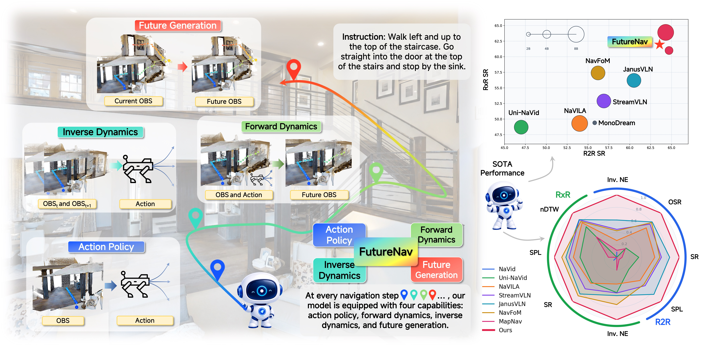
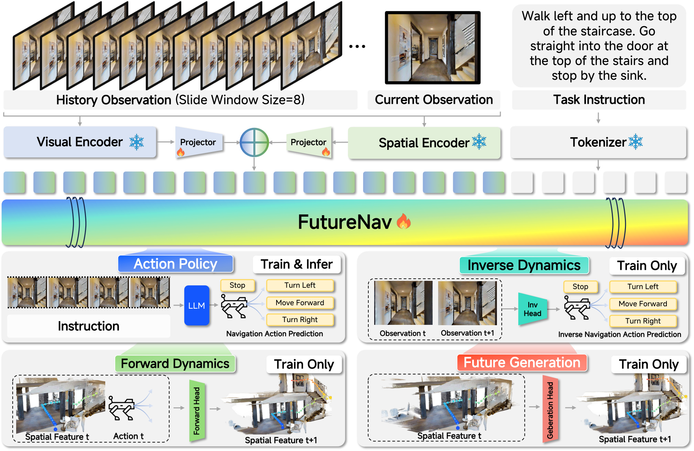

<div align="center">

<h1>FutureNav: Unified World-Action Modeling for
Vision-and-Language Navigation</h1>

<p align="center">
  <a href="https://arxiv.org/abs/2606.30367"></a>
  &nbsp;
  <a href="https://www.youtube.com/watch?v=l5PGtVXCAGc&list=PLEebLxc874OM"></a>
  &nbsp;
  <a href="https://linglingxiansen.github.io/FutureNav/"></a>
  &nbsp;
  <a href="https://huggingface.co/llxs/FutureNav"></a>
  &nbsp;
  <a href="https://github.com/linglingxiansen/FutureNav"></a>
</p>

[](assets/fig1_v4.jpg)

[](assets/fig2_v2.pdf)

</div>

This repository contains the official FutureNav codebase for VLN-CE R2R and RxR, including environment setup, data preparation, model checkpoints, and evaluation scripts.

## Environment

Create the evaluation environment with Python 3.9:

```bash
conda create -n futurenav python=3.9 -y
conda activate futurenav
```

Install Habitat-Sim v0.1.7:

```bash
conda install -c aihabitat -c conda-forge habitat-sim=0.1.7=py3.9_headless_linux_856d4b08c1a2632626bf0d205bf46471a99502b7
```

Install Habitat-Lab v0.1.7:

```bash
git clone --branch v0.1.7 https://github.com/facebookresearch/habitat-lab.git
cd habitat-lab
pip install -r requirements.txt
pip install -r habitat_baselines/rl/requirements.txt
pip install -r habitat_baselines/rl/ddppo/requirements.txt
python setup.py develop --all
cd ..
```

Install FutureNav dependencies:

```bash
pip install -r requirements.txt
pip install -r VLN_CE/requirements.txt
```

If `flash-attn` needs a prebuilt wheel for your CUDA/PyTorch version, install that wheel before running evaluation.

## Data

Place all data under the repository-local `data/` directory. The configs use relative paths only.

Matterport3D scenes:

```text
data/scene_datasets/mp3d/{scene_id}/{scene_id}.glb
```

R2R VLN-CE episodes:

```bash
mkdir -p data/datasets
gdown https://drive.google.com/uc?id=1fo8F4NKgZDH-bPSdVU3cONAkt5EW-tyr
unzip R2R_VLNCE_v1-3_preprocessed.zip -d data/datasets
```

Expected R2R layout:

```text
data/datasets/R2R_VLNCE_v1-3_preprocessed/
  val_seen/val_seen.json.gz
  val_unseen/val_unseen.json.gz
```

RxR VLN-CE episodes:

```bash
mkdir -p data/datasets
gdown https://drive.google.com/uc?id=145xzLjxBaNTbVgBfQ8e9EsBAV8W-SM0t
unzip RxR_VLNCE_v0.zip -d data/datasets
```

Expected RxR layout:

```text
data/datasets/RxR_VLNCE_v0/
  val_seen/val_seen_guide.json.gz
  val_seen/val_seen_guide_gt.json.gz
  val_unseen/val_unseen_guide.json.gz
  val_unseen/val_unseen_guide_gt.json.gz
```

Place model checkpoints and optional pretrained backbones under local paths such as:

```text
pretrain_models/
outputs/train/
```

## Evaluation

The evaluation scripts can activate a conda environment if these variables are set:

```bash
export CONDA_SH=/path/to/miniconda3/etc/profile.d/conda.sh
export CONDA_ENV=futurenav
```

If Habitat-Sim needs its extension path added to `LD_LIBRARY_PATH`, set:

```bash
export HABITAT_SIM_EXT=/path/to/env/lib/python3.9/site-packages/habitat_sim/_ext
```

Run R2R evaluation:

```bash
bash eval/eval_r2r.sh /path/to/checkpoint val_unseen 1 0
```

Run RxR evaluation:

```bash
bash eval/eval_rxr.sh /path/to/checkpoint val_unseen 1 0
```

Arguments are:

```text
<model_path> [split] [procs_per_gpu] [max_episodes]
```

Use `max_episodes=0` to evaluate all episodes. Results are written to:

```text
outputs/eval/r2r/
outputs/eval/rxr/
```

## Training

Coming soon...

## TODO

- [x] Release source code.
- [x] Release checkpoints ([HuggingFace](https://huggingface.co/llxs/FutureNav)).
- [x] Release evaluation scripts (`eval/eval_r2r.sh`, `eval/eval_rxr.sh`).
- [ ] Release training dataset.
- [ ] Release training scripts.

## Acknowledgments

We thank the open-source communities behind [VLN-CE](https://github.com/jacobkrantz/VLN-CE), [NaVid](https://github.com/jzhzhang/NaVid-VLN-CE), [JanusVLN](https://github.com/MIV-XJTU/JanusVLN), [Qwen3-VL](https://github.com/QwenLM/Qwen3-VL), and related projects for their valuable codebases and benchmarks.

## Citation

If you find this work useful for your research, please consider citing:

```bibtex
@article{FutureNav,
  title={FutureNav: Unified World-Action Modeling for Vision-and-Language Navigation},
  author={Zhang, Lingfeng and Gong, Zeying and Hao, Xiaoshuai and Fu, Haoxiang and Zhang, Qiang and Zhou, Mingliang and Ye, Hangjun and Liang, Xiaojun and Liang, Junwei and Ding, Wenbo},
  journal={arXiv preprint arXiv:2606.30367},
  year={2026}
}
```
